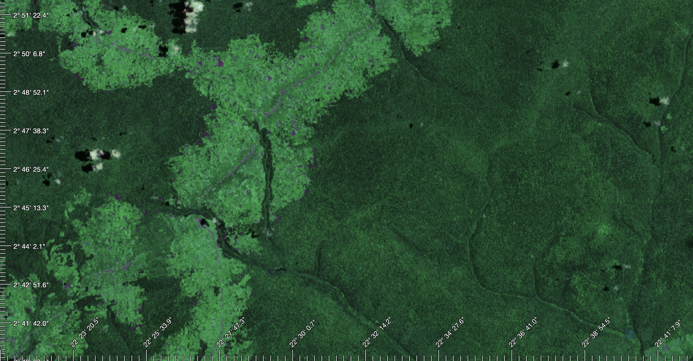

# GeoTickGen

Lat/Long ticks generator for mapbox-gl / maplibre maps.

 

## Installation

There are two main methods to include `GeoTickGen` in your project:

### 1. Directly from a CDN:

```javascript
import { GeoTickGen } from "https://cdn.jsdelivr.net/npm/@fxi/geotickgen/+esm";
```

### 2. Using npm:

First, install the package:

```bash
npm install @fxi/geotickgen
```

Then, import in your project:

```javascript
import { GeoTickGen } from "@fxi/geotickgen";
```

## Usage

After importing, you can easily use `GeoTickGen` to generate Lat/Long ticks on your mapbox-gl or maplibre maps:

```javascript
const map = new mapboxgl.Map({
  // ... your map initialization here
});

const tickGen = new GeoTickGen(map, {
  // ... your optional configurations here
});
```

```css
.gtg-container {
  position: absolute;
  top: 0;
  left: 0;
  width: 100%;
  height: 100%;
  pointer-events: none;
}

.gtg-outline {
  stroke: #fff;
  fill: #000;
  font-family: monospace;
  font-size: 12px; /*should match configuration*/
  paint-order: stroke;
  stroke-width: 3px;
  stroke-linecap: round;
  stroke-linejoin: round;
}
```


## Configuration

Default options:

```javascript
{
  ticks: {
    sizeMinor: 10, // tick width
    sizeMajor: 20, // major tick width
    nStepMinor: 50, // number of step
    nStepMajor: 10, // major step each n
    enableLat: true, // show latitudes 
    enableLng: true, // show longitudes
    fontSize: 12, // for compute label position. Should match CSS
    offsetLabel: 4, // distance tick-label
    offsets: { // offsets of ticks bars
      lat: {
        top: 0,
        right: 0,
        bottom: 0,
        left: 0,
      },
      lng: {
        top: 0,
        right: 0,
        bottom: 0,
        left: 0,
      },
    },
  },
};
```

You can override these options by passing in your own configuration object when creating an instance of `GeoTickGen`.

## Issues & Contributions

If you encounter any issues or would like to contribute, please open an issue or a pull request on the [GitHub repository](https://github.com/fxi/geotickgen).

## License

MIT

